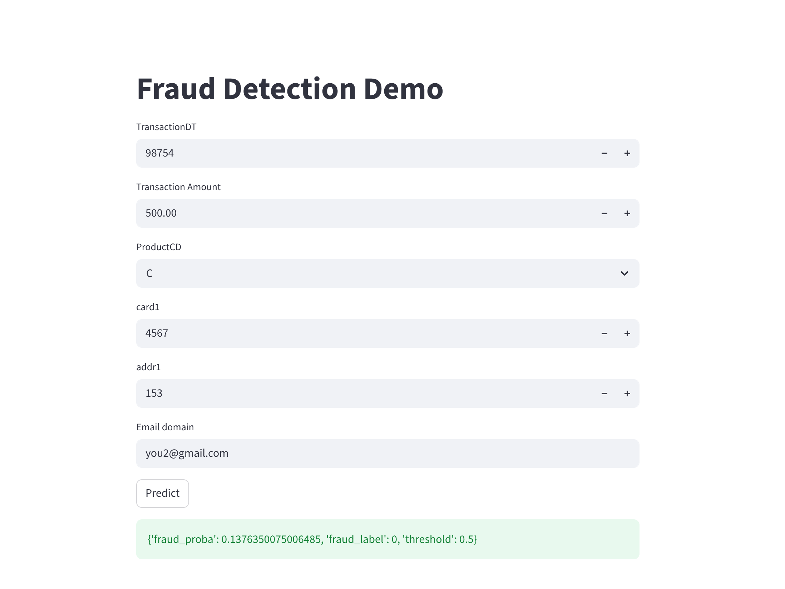
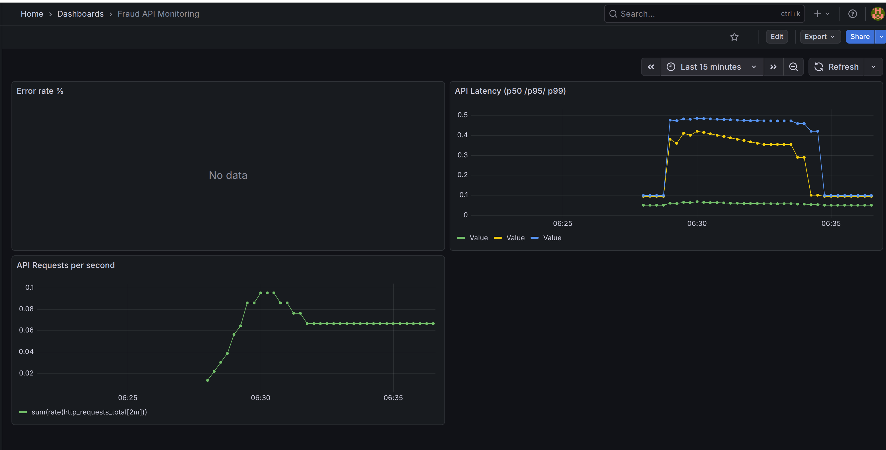

# End-to-End Fraud Detection MLOps System

Production-ready machine learning system for real-time credit card fraud detection with full MLOps pipeline.


## Streamlit UI demo 

<p align="center">
  
</p>

## Grafana dashboard

<p align="center">
  
</p>


## Live Production System

This project is deployed as a production service on AWS.

| Service | URL |
|-------|------|
| Streamlit UI | https://roykeanesyangu.com |
| FastAPI Docs | https://roykeanesyangu.com/api/docs |
| Prometheus Monitoring | https://roykeanesyangu.com/prometheus |
| Grafana Dashboard | https://roykeanesyangu.com/grafana |

The system is hosted on an AWS EC2 instance with Nginx reverse proxy and HTTPS.

## Tech Stack


## Production Deployment Architecture


## Key Features

- Real-time Fraud Prediction API — FastAPI service serving fraud probability predictions for incoming transactions.
- Interactive Streamlit Dashboard — Web interface allowing users to simulate transactions and view fraud risk predictions instantly.
- Production Deployment on AWS — Containerised services deployed on AWS EC2 with Nginx reverse proxy and HTTPS using a custom domain.
- Containerised Microservice Architecture — API, UI, monitoring, and supporting services orchestrated using Docker Compose.
- Model & Data Versioning — DVC pipeline with remote storage on AWS S3 ensuring reproducible experiments and dataset traceability.
- Experiment Tracking — MLflow used to log model parameters, evaluation metrics, and artifacts.
- Production Monitoring — Prometheus collects API metrics while Grafana visualises system performance (latency, throughput, errors).
- Automated CI/CD Pipeline — GitHub Actions runs unit tests and builds Docker images automatically on every push.
- Reproducible ML Pipeline — Entire training workflow reproducible using ```dvc repro```.

## Business Problem

Financial fraud causes billions of dollars in losses every year. Detecting fraudulent transactions quickly and accurately is critical for financial institutions.

This project implements a real-time fraud detection system that:

- Estimates the probability that a transaction is fraudulent
- Enables rapid decision-making for transaction approval or investigation
- Demonstrates a scalable and reproducible machine learning pipeline from training to deployment
- Exposes the model through a production-ready API and interactive dashboard

## Dataset 
The dataset used in for modelling: Kaggle IEEE-CIS Fraud Detection data 
```
https://www.kaggle.com/competitions/ieee-fraud-detection/data
```


## System Architecture


## Model Performance

Forward-time validation (monthly split):

- Mean AUC: **0.94**
- Std: 0.004
- Minimum: 0.935
- Maximum: 0.947

## MLOps Capabilities


- **Data & Model Versioning**: DVC tracks datasets, model artifacts, and pipeline outputs with remote storage on AWS S3 to ensure experiment reproducibility and dataset traceability.

- **Experiment Tracking**: MLflow logs model parameters, training metrics, and artifacts, enabling structured experiment comparison and reproducible model development.

- **Reproducible ML Pipelines**: The entire training workflow is defined using DVC pipelines and can be rebuilt using dvc repro.

- **Production Model Serving**: FastAPI provides a REST API for real-time fraud prediction with structured request validation and health endpoints.

- **Interactive Application Layer**: Streamlit dashboard enables users to simulate transactions and view model predictions through an accessible web interface.

- **Containerised Architecture**: Docker containers package the API, UI, and supporting services for consistent development and deployment environments.

- **Service Orchestration**: Docker Compose orchestrates multi-service deployment including FastAPI, Streamlit, Prometheus, and Grafana.

- **Cloud Deployment**: Services are deployed on AWS EC2 and exposed through Nginx reverse proxy with HTTPS using a custom domain.

- **Monitoring & Observability**: Prometheus collects API metrics (request rate, latency, error rate) while Grafana provides visual dashboards for system monitoring.

- **Continuous Integration / CI/CD**: GitHub Actions automatically runs unit tests and builds Docker images on every push to ensure code reliability and maintain build consistency.
## Run Locally

### Clone repository
```
git clone https://github.com/Roy16Keane/End-to-End-Fraud-detection-system.git
cd End-to-End-Fraud-detection-system
```
Run services
```
docker compose --build
```

Access:
- API: http://localhost:8000/docs  
- Streamlit: http://localhost:8501
- Prometheus: http://localhost:9090
- Grafana: http://localhost:3000
## API Example

POST /predict
```
Request:
{
  "transaction": {
    "TransactionDT": 100000,
    "TransactionAmt": 49.99,
    "ProductCD": "W",
    "card1": 1234,
    "addr1": 200,
    "P_emaildomain": "gmail.com"
  },
  "threshold": 0.5
}

```
output 
```
{
  "fraud_proba": 0.05,
  "fraud_label": 0,
  "threshold": 0.5
}
```
## Future Improvements
- Kubernetes deployment (EKS)
- CI/CD automated cloud deployment
- Alerting with Prometheus Alertmanager
- Feature store integration
- Online model retraining pipeline

## Author

Roy Keane Syangu  
MSc Robotics & AI | Machine Learning & MLOps Engineer 
 
## License
This project is licensed under the MIT License.

