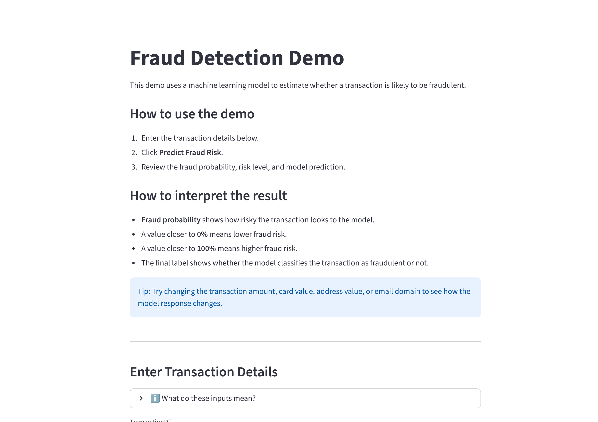
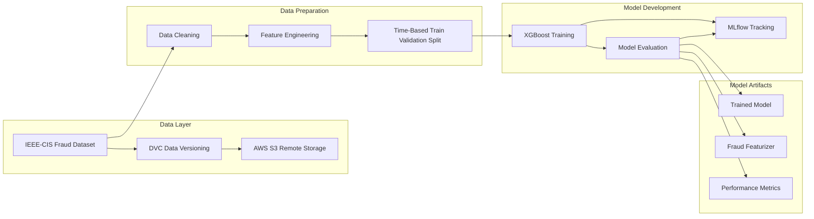
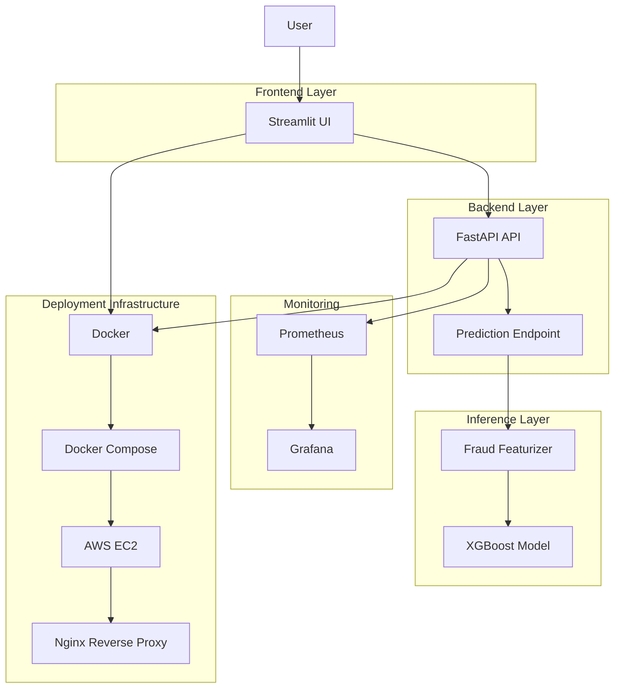
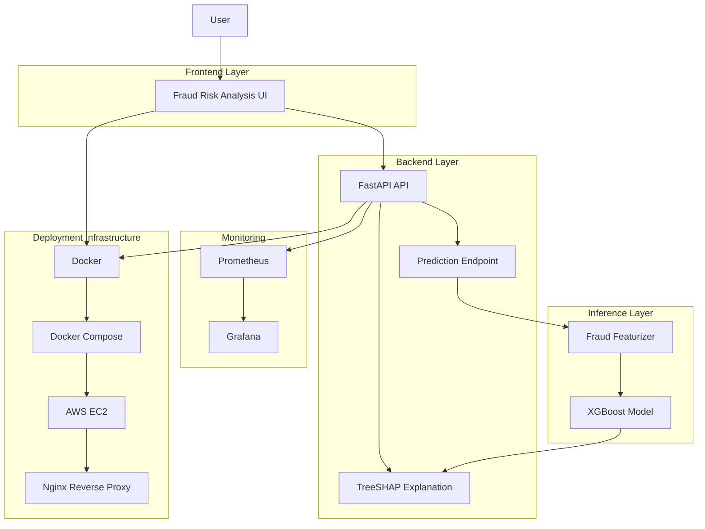

# End-to-End Fraud Risk Analysis & MLOps System

Production-ready machine learning system for real-time fraud risk scoring, explainable AI, monitoring, and cloud deployment.


---

## Overview

This project implements an end-to-end fraud risk analysis platform built around the IEEE-CIS Fraud Detection dataset.

The system goes beyond returning a binary fraud prediction. It provides:

- Real-time fraud probability scoring
- Configurable fraud-classification thresholds
- Business-friendly risk bands
- Local TreeSHAP explanations for individual transactions
- Risk-increasing and risk-reducing factors
- SHAP waterfall visualisation
- Fraud analyst summaries and suggested review actions
- Production API monitoring using Prometheus and Grafana
- Reproducible MLOps workflows using DVC and MLflow
- Containerised deployment on AWS EC2

The goal is to demonstrate how a machine learning model can be taken from experimentation through deployment, monitoring, explainability, and stakeholder-facing analysis.

---

# Application Demo

## Fraud Risk Analysis Interface

The Streamlit application allows users to enter transaction information, configure the classification threshold, and analyse the model's fraud-risk assessment.

<p align="center">
  
</p>

The interface provides:

- Transaction-level fraud probability
- Risk level classification
- Fraud / non-fraud model decision
- Configurable decision threshold
- Adjustable number of explanation factors

---

## Fraud Analyst Summary

Rather than exposing only raw model outputs, the application converts the prediction into an analyst-friendly assessment.

<p align="center">
  
</p>

The analyst summary includes:

- Risk classification
- Fraud probability relative to the configured threshold
- Key model drivers
- Data-quality observations
- Suggested analyst action

The suggested action is intended to support analyst judgement rather than replace fraud policies, business rules, or manual investigation.

---

## Explainable AI — Local TreeSHAP

Each prediction can be explained using XGBoost's native TreeSHAP contribution calculation.

<p align="center">
  
</p>

The waterfall visualisation shows how individual model signals move the transaction away from the model baseline.

Positive contributions move the model toward higher fraud risk, while negative contributions move it toward lower fraud risk.

The API also exposes separate:

- Risk-increasing factors
- Risk-reducing factors
- SHAP contribution magnitude
- Feature group
- Feature value
- Business description
- Missing-value status

<p align="center">
  
</p>

<p align="center">
  
</p>

Because many IEEE-CIS variables are anonymised, the interface uses conservative descriptions rather than inventing business meanings for hidden features.

For example:

```
C14
```
Is presented as:

```
Anonymised transaction count signal 14
```

---
# Production Monitoring 

Prometheus collects application and model-serving metrics, while Grafana provides operational and business-level monitoring.

## Usage Overview


<p align="center">
  
</p>

The dashboard tracks:

- Total predictions
- Predictions during the last 24 hours
- Timestamp of the latest prediction
- Prediction errors

---

## Prediction Outcomes

<p align="center">
  
</p>

Fraud and normal predictions can be monitored over time to understand model activity and output distribution.

---

## Model Activity and API Performance


<p align="center">
  
</p>

Operational metrics include:

- Predictions per minute

- Average API response time

- Model inference latency

- p50 / p95 / p99 latency

- Request errors

This provides visibility into both machine learning behaviour and production service health.

---

# Live Production System

This project is deployed as a production service on AWS.

| Service | URL |
|-------|------|
| Streamlit UI | https://roykeanesyangu.com |
| FastAPI Docs | https://roykeanesyangu.com/api/docs |
| Prometheus Monitoring | https://roykeanesyangu.com/prometheus |
| Grafana Dashboard | https://roykeanesyangu.com/grafana |

The system is hosted on an AWS EC2 instance with Nginx reverse proxy and HTTPS.

---

# Tech Stack


---

# Architecture

## Machine Learning Training  Pipeline 


```mermaid
flowchart LR

    subgraph DATA_LAYER[Data Layer]
        RAW[IEEE-CIS Fraud Dataset]
        DVC_NODE[DVC Data Versioning]
        S3_NODE[AWS S3 Remote Storage]
    end

    subgraph PREP_LAYER[Data Preparation]
        CLEAN[Data Cleaning]
        FE[Feature Engineering]
        SPLIT[Time-Based Train Validation Split]
    end

    subgraph MODEL_LAYER[Model Development]
        TRAIN[XGBoost Training]
        EVAL[Model Evaluation]
        MLFLOW_NODE[MLflow Tracking]
    end

    subgraph ARTIFACT_LAYER[Model Artifacts]
        MODELFILE[Trained Model]
        FEATURIZER[Fraud Featurizer]
        METRICS[Performance Metrics]
    end

    RAW --> CLEAN
    RAW --> DVC_NODE
    DVC_NODE --> S3_NODE

    CLEAN --> FE
    FE --> SPLIT
    SPLIT --> TRAIN
    TRAIN --> EVAL

    TRAIN --> MLFLOW_NODE
    EVAL --> MLFLOW_NODE

    EVAL --> MODELFILE
    EVAL --> FEATURIZER
    EVAL --> METRICS
```
## Production Deployment Architecture


```mermaid
flowchart TD

    USER[User]

    subgraph FRONTEND[Frontend Layer]
        STREAMLIT[Streamlit UI]
    end

    subgraph API[Backend Layer]
        FASTAPI[FastAPI API]
        PREDICT[Prediction Endpoint]
    end

    subgraph MODEL[Inference Layer]
        MODELFILE[XGBoost Model]
        FEATURIZER[Fraud Featurizer]
    end

    subgraph MONITORING[Monitoring]
        PROM[Prometheus]
        GRAFANA[Grafana]
    end

    subgraph INFRA[Deployment Infrastructure]
        DOCKER[Docker]
        COMPOSE[Docker Compose]
        EC2[AWS EC2]
        NGINX[Nginx Reverse Proxy]
    end

    USER --> STREAMLIT

    STREAMLIT --> FASTAPI
    FASTAPI --> PREDICT

    PREDICT --> FEATURIZER
    FEATURIZER --> MODELFILE

    FASTAPI --> PROM
    PROM --> GRAFANA

    FASTAPI --> DOCKER
    STREAMLIT --> DOCKER

    DOCKER --> COMPOSE
    COMPOSE --> EC2
    EC2 --> NGINX
```


```mermaid
flowchart TD

    USER[User]

    subgraph FRONTEND[Frontend Layer]
        STREAMLIT[Fraud Risk Analysis UI]
    end

    subgraph API[Backend Layer]
        FASTAPI[FastAPI API]
        PREDICT[Prediction Endpoint]
        EXPLAIN[TreeSHAP Explanation]
    end

    subgraph MODEL[Inference Layer]
        FEATURIZER[Fraud Featurizer]
        MODELFILE[XGBoost Model]
    end

    subgraph MONITORING[Monitoring]
        PROM[Prometheus]
        GRAFANA[Grafana]
    end

    subgraph INFRA[Deployment Infrastructure]
        DOCKER[Docker]
        COMPOSE[Docker Compose]
        EC2[AWS EC2]
        NGINX[Nginx Reverse Proxy]
    end

    USER --> STREAMLIT
    STREAMLIT --> FASTAPI

    FASTAPI --> PREDICT
    FASTAPI --> EXPLAIN

    PREDICT --> FEATURIZER
    FEATURIZER --> MODELFILE
    MODELFILE --> EXPLAIN

    FASTAPI --> PROM
    PROM --> GRAFANA

    FASTAPI --> DOCKER
    STREAMLIT --> DOCKER

    DOCKER --> COMPOSE
    COMPOSE --> EC2
    EC2 --> NGINX
```
---
# Key Features

- Real-time Fraud Risk Scoring — FastAPI endpoint returns fraud probability, model classification, risk band, and configurable threshold results.

- Explainable AI — XGBoost native TreeSHAP explains individual predictions without relying on a separate explainer object.

- SHAP Waterfall Visualisation — Shows how major model signals move the transaction from the model baseline to its final raw score.

- Business-Friendly Explanations — Technical feature names are translated into readable labels and conservative descriptions.

- Fraud Analyst Summary — Converts probability, threshold, explanation factors, and data quality into an operationally understandable assessment.

- Risk and Protective Factors — Separates signals that increase fraud risk from signals that reduce it.

- Interactive Streamlit Application — Allows users to simulate transactions, adjust thresholds, inspect explanations, and review technical model details.

- Production Monitoring — Prometheus and Grafana monitor prediction volume, model outcomes, latency, response times, and application errors.

- AWS Deployment — Dockerised application deployed on EC2 using Nginx reverse proxy and HTTPS.

- Data and Model Versioning — DVC tracks data and pipeline artifacts with AWS S3 remote storage.

- Experiment Tracking — MLflow records model parameters, metrics, and artifacts.

- Continuous Integration — GitHub Actions runs automated tests and Docker builds on every push.

- Reproducible ML Pipeline — Training workflow can be reproduced using ```dvc repro```.

---

# Business Problem 

Financial fraud creates substantial financial and operational losses.

Traditional machine learning systems often stop at providing a probability or binary classification. In real fraud operations, analysts also need to understand:

- Why a transaction was flagged

- Which signals influenced the model

- How strongly those signals affected the decision

- Whether important information was unavailable

- Whether the transaction crossed the organisation's review threshold

This project addresses that gap by combining fraud prediction with explainability, analyst-facing interpretation, monitoring, and production deployment.

The system is designed as a decision-support tool rather than an autonomous fraud decision-maker.

---

# Dataset 

The model is trained using the Kaggle IEEE-CIS Fraud Detection dataset:

```
https://www.kaggle.com/competitions/ieee-fraud-detection/data
```
Many fields in the dataset are intentionally anonymised. The application therefore avoids assigning unsupported real-world meanings to hidden variables.

---

# Model Performance 

Forward-time validation using monthly splits:

| Metrics| Result |
|-------|------|
| Mean ROC-AUC| **0.94**|
| Standard deviation | 0.004|
| Minimum fold AUC | 0.935 |
| Maximum fold AUC | 0.947|

A time-aware validation strategy was used to better approximate how the model would perform on future transactions.
---

# Explainability

For each transaction, the prediction API can return a local explanation.

Example:
```
{
  "fraud_proba": 0.1404,
  "fraud_label": 0,
  "threshold": 0.5,
  "risk_level": "low",
  "explanation": {
    "method": "XGBoost TreeSHAP",
    "output_space": "raw_model_score",
    "summary": "The model estimated a low fraud probability...",
    "top_risk_factors": [],
    "top_protective_factors": [],
    "waterfall": {},
    "executive_summary": {}
  }
}
```

TreeSHAP contributions are returned in the model's raw score space.

The Streamlit application translates those contributions into a more accessible visual and analyst-facing explanation.

---

# MLOps Capabilities


- **Data & Model Versioning**: DVC tracks datasets, model artifacts, and pipeline outputs with AWS S3 remote storage.

- **Experiment Tracking**: MLflow logs model parameters, metrics, and artifacts.

- **Reproducible ML Pipelines**: The training workflow can be executed using:

```dvc repro```

- **Production Model Serving**: FastAPI provides prediction and health endpoints.

- **Explainable inference**: Predictions can optionally return TreeSHAP feature contributions and analyst-oriented explanations.

- **Interactive Application Layer**: Streamlit provides the transaction-analysis interface.

- **Containerised Architecture**: FastAPI, Streamlit, Prometheus, and Grafana run as Docker services.

- **Service Orchestration**: Docker Compose coordinates local and production services.

- **Cloud Deployment**: Services are deployed on AWS EC2.

- **Monitoring & Observability**: Prometheus and Grafana provide operational and business-level visibility.

- **Continuous Integration / CI/CD**: GitHub Actions validates code and Docker builds on every push.

---

# Run Locally

## Clone repository
```
git clone https://github.com/Roy16Keane/End-to-End-Fraud-detection-system.git
cd End-to-End-Fraud-detection-system
```
Run services
```
docker compose --build
```

Access:
- API: http://localhost:8000/docs  
- Streamlit: http://localhost:8501
- Prometheus: http://localhost:9090
- Grafana: http://localhost:3000

## API Example

POST /predict
```
Request:
{
  "transaction": {
    "TransactionDT": 100000,
    "TransactionAmt": 150.0,
    "ProductCD": "W",
    "card1": 1001,
    "card2": 321,
    "card3": 150,
    "card5": 226,
    "addr1": 315,
    "addr2": 87,
    "P_emaildomain": "gmail.com",
    "R_emaildomain": "gmail.com"
  },
  "threshold": 0.5,
  "explain": true,
  "max_explanation_features": 5
}
```
Response
```
{
  "fraud_proba": 0.1404,
  "fraud_label": 0,
  "threshold": 0.5,
  "risk_level": "low",
  "explanation": {
    "method": "XGBoost TreeSHAP",
    "output_space": "raw_model_score",
    "predicted_probability": 0.1404,
    "top_risk_factors": [],
    "top_protective_factors": [],
    "waterfall": {},
    "executive_summary": {}
  }
}
```
---

# Limitations

- The IEEE-CIS dataset contains many anonymised variables, which limits direct business interpretation of some model features.
- SHAP explanations describe model behaviour and association; they do not establish causal relationships.
- A fraud probability should support, not replace, fraud analyst judgement.
- The demonstration threshold is configurable and is not intended to represent the optimal production threshold for a real financial institution.
- The project does not currently implement automated model retraining or production drift detection.


# Future Improvements
- Automated cloud deployment through CI/CD
- Prometheus Alertmanager integration
- Model and feature drift monitoring
- Automated retraining workflow
- Feature store integration
- Kubernetes / EKS deployment


## Author

Roy Keane Syangu  
MSc Robotics & AI | Machine Learning & MLOps Engineer 
 
## License
This project is licensed under the MIT License.


